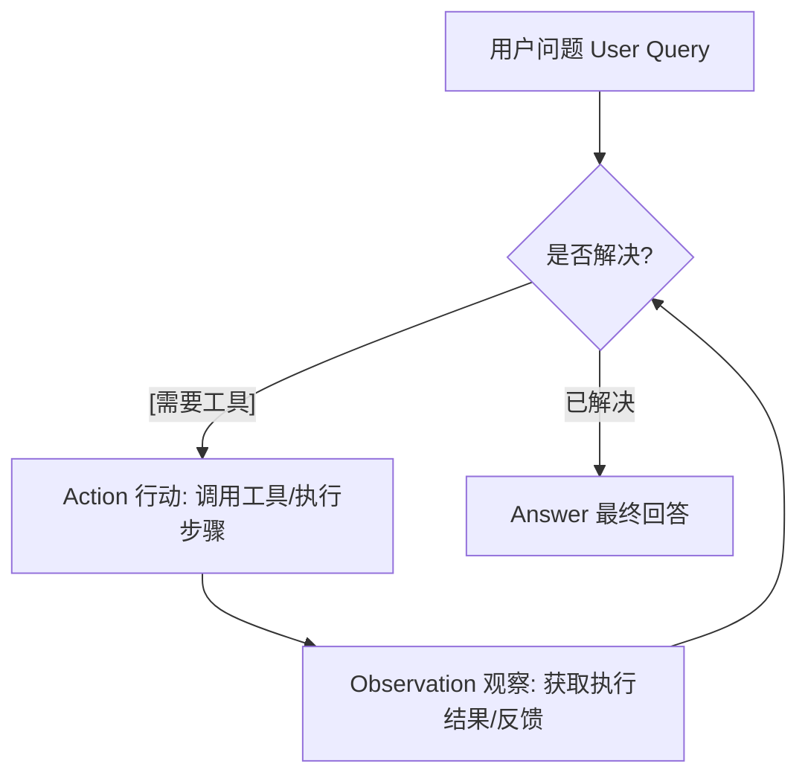
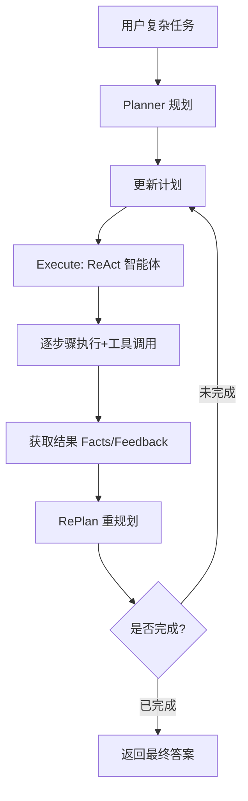

# Modern Agent [02] LangChain & LangGraph 实现 ReAct

## ReAct 核心逻辑

核心为 Reasoning（推理）与 Acting（行动）相结合，大语言模型会循环执行思考、调用工具、观察结果、修正推理的完整流程，直至生成最终答案，这个循环是智能体完成复杂任务的核心。

## LangChain 实现 ReAct 特点

采用高度封装的架构，通过 AgentExecutor 即可一键启动智能体，上手学习成本低。流程采用线性隐式执行模式，Thought → Action → Observation 的循环逻辑由框架自动接管，上下文信息依靠 agent_scratchpad 进行隐式维护。自定义分支、循环、中断的拓展能力较弱，更适合搭建简易智能体，调试与追踪能力相对有限。

## LangGraph 实现 ReAct 特点

基于状态图 StateGraph 构建，节点与执行流程均为显式定义。可将执行流程拆分为 reason（推理）、act（执行工具）、should_continue（终止判断）等独立节点，状态 State 支持手动定义且可自由扩展字段。流程可控性极高，支持分支、循环、重试等复杂逻辑，工程化应用能力更强。搭配 LangSmith 可实现每一步迭代的可视化展示，调试与监控能力达到最优。

## 核心差异


| 维度       | LangChain ReAct | LangGraph ReAct  |
| ---------- | --------------- | ---------------- |
| 控制流     | 隐式线性        | 显式图结构       |
| 状态管理   | 隐式 scratchpad | 显式 State       |
| 扩展性     | 弱              | 强               |
| 调试监控   | 一般            | 优秀 (LangSmith) |
| ReAct 循环 | 框架自动实现    | 手动条件控制     |

## 实践示例

### 依赖安装

```bash
pip install langchain langgraph langchain-openai python-dotenv
```

---

### LangChain 实现 ReAct（多工具 + 详细注释）

核心：**隐式循环**、高度封装、`agent_scratchpad`维护上下文、一键调用

```python
from langchain_openai import ChatOpenAI
from langchain.agents import create_react_agent, AgentExecutor
from langchain.tools import tool
from langchain_core.prompts import ChatPromptTemplate

# ===================== 1. 定义多工具：加减乘除 =====================
# 工具是ReAct的执行单元，LLM会自主选择调用
@tool
def add(a: int, b: int) -> int:
    """加法计算"""
    return a + b

@tool
def sub(a: int, b: int) -> int:
    """减法计算"""
    return a - b

@tool
def mul(a: int, b: int) -> int:
    """乘法计算"""
    return a * b

@tool
def div(a: int, b: int) -> float:
    """除法计算"""
    return a / b if b != 0 else 0

# 工具集合
tools = [add, sub, mul, div]

# ===================== 2. 初始化大模型 =====================
# 模型调用：指定gpt-3.5-turbo，温度0保证结果稳定
llm = ChatOpenAI(model="gpt-3.5-turbo", temperature=0)

# ===================== 3. ReAct专用Prompt模板 =====================
# 核心：agent_scratchpad 存储思考/行动/观察的历史记录（隐式状态）
prompt = ChatPromptTemplate.from_messages([
    ("system", "你是一个计算助手，严格按照ReAct逻辑：思考-行动-观察，最终给出答案"),
    ("user", "{input}"),
    ("agent_scratchpad", "{agent_scratchpad}")
])

# ===================== 4. 创建ReAct智能体 =====================
# 绑定模型、工具、Prompt，框架自动封装ReAct逻辑
agent = create_react_agent(llm, tools, prompt)

# ===================== 5. 执行器：自动运行ReAct循环 =====================
# AgentExecutor 隐式执行：思考→调用工具→观察结果→循环，直到完成任务
executor = AgentExecutor(agent=agent, tools=tools, verbose=True)

# ===================== 6. 调用执行 =====================
# 输入复杂计算，测试多工具调用
print(executor.invoke({"input": "10加5，结果乘以2，再除以3等于多少"}))
```

---

### LangGraph 实现 ReAct（多工具 + 显式循环 + 详细注释）

核心：**显式状态**、**手动控制循环**、节点化流程、完全可控

```python
from typing import TypedDict, Literal
from langgraph.graph import StateGraph, END
from langchain_openai import ChatOpenAI
from langchain.tools import tool
from langchain_core.messages import HumanMessage

# ===================== 1. 定义加减乘除多工具 =====================
@tool
def add(a: int, b: int) -> int:
    """加法计算"""
    return a + b

@tool
def sub(a: int, b: int) -> int:
    """减法计算"""
    return a - b

@tool
def mul(a: int, b: int) -> int:
    """乘法计算"""
    return a * b

@tool
def div(a: int, b: int) -> float:
    """除法计算"""
    return a / b if b != 0 else 0

tools = [add, sub, mul, div]

# ===================== 2. 大模型调用：绑定工具 =====================
# 模型绑定工具，让LLM具备调用工具的能力
llm = ChatOpenAI(model="gpt-3.5-turbo", temperature=0).bind_tools(tools)

# ===================== 3. 显式定义状态（核心区别） =====================
# 手动管理所有上下文，替代LangChain的隐式agent_scratchpad
class State(TypedDict):
    question: str       # 用户问题
    messages: list      # 对话/思考/工具调用历史
    result: str         # 最终结果

# ===================== 4. 定义节点：推理 + 模型调用 =====================
# ReAct的思考环节：LLM分析问题，决定是否调用工具
def reason_act(state: State):
    # 自定义Prompt模板，指导LLM使用ReAct逻辑
    prompt = f"问题：{state['question']}\n根据问题选择工具调用，无需工具则直接回答"
    # 调用大模型，获取思考/工具调用结果
    response = llm.invoke([HumanMessage(content=prompt)])
    # 更新状态：追加模型返回结果
    return {"messages": state["messages"] + [response]}

# ===================== 5. 核心：ReAct循环判断 =====================
# 显式控制流程：有工具调用→继续执行，无→结束
def should_continue(state: State) -> Literal["end", "act"]:
    last_message = state["messages"][-1]
    # 判断模型是否需要调用工具
    if not last_message.tool_calls:
        return "end"
    return "act"

# ===================== 6. 定义节点：执行工具 =====================
# ReAct的行动环节：调用选中的工具，获取结果
def act(state: State):
    last_message = state["messages"][-1]
    tool_call = last_message.tool_calls[0]
    # 匹配并执行工具
    tool_map = {t.name: t for t in tools}
    selected_tool = tool_map[tool_call["name"]]
    observation = selected_tool.invoke(tool_call["args"])
    # 更新状态：追加工具执行结果（观察环节）
    return {"messages": state["messages"] + [HumanMessage(content=f"工具结果：{observation}")]}

# ===================== 7. 构建状态图：定义ReAct循环流程 =====================
workflow = StateGraph(State)
# 添加节点
workflow.add_node("reason_act", reason_act)
workflow.add_node("act", act)
# 设置入口
workflow.set_entry_point("reason_act")
# 条件边：实现ReAct循环（思考→判断→调用工具→回到思考）
workflow.add_conditional_edges("reason_act", should_continue, {"act": "act", "end": END})
# 工具执行完，回到思考节点，形成循环
workflow.add_edge("act", "reason_act")

# 编译工作流
app = workflow.compile()

# ===================== 8. 调用执行 =====================
res = app.invoke({
    "question": "100减20，结果乘以3，再除以4等于多少",
    "messages": [],
    "result": ""
})
print("最终回答：", res["messages"][-1].content)
```

---

## 执行流程图

### ReAct 基础执行流程



### 规划式 ReAct 执行流程



### 总结

1. **LangChain** 适合快速开发，**框架自动处理 ReAct 循环**，无需关心底层流程；
2. **LangGraph** 适合工程化落地，**手动定义状态和循环**，完全可控，配合 LangSmith 调试更高效；
3. 两者的模型调用、工具定义逻辑一致，核心区别是**隐式封装**与**显式控制**。
